# Fantasy Football Weekly Predictor

**Architecture, installation, operations, feature definitions, model methodology, API, and troubleshooting guide**

> **Project status:** Local Python/FastAPI proof of concept (MVP). It generates experimental NFL QB/RB/WR/TE statistical projections and full-PPR fantasy point estimates. It is not a validated betting or fantasy lineup optimizer. NFL data availability, roster accuracy, and forecast accuracy are not guaranteed.

## 1. What the application does

The Fantasy Football Weekly Predictor is a local web application that:

- Lets you choose an NFL **season** and **target week**.
- Retrieves historical NFL player game statistics through `nflreadpy` (nflverse data).
- Uses the NFL regular-season schedule to identify teams scheduled to play in the target week.
- Builds a candidate player list from *recent historical participation*, rather than requiring actual statistics for the target week.
- Calculates lagged and rolling player-performance features.
- Trains separate regression models by position and statistical output.
- Estimates passing, rushing and receiving production, then converts those estimates into **full-PPR fantasy points**.
- Displays sortable/filterable player projections in a browser.
- Offers a historical **Backtest Week** report comparing projections against published actual fantasy points.

### What it can provide

For a player included in its candidate pool, the app can return projected passing yards, passing TDs, interceptions, rushing yards, rushing TDs, receptions, receiving yards, receiving TDs, projected fantasy points, and a rough low/high point range. It also returns player, position, team, season and week.

### What it does **not** currently provide

- Confirmed active/inactive status, injuries, depth charts, or transaction-aware current rosters.
- Opponent defensive strength, weather, betting lines, snap-share forecasts, game script, or confirmed starters.
- Kicker or team-defense projections; only **QB, RB, WR, TE** are supported.
- A guaranteed complete player pool; rookies and players without recent appearances may be missing.
- Probabilistically calibrated prediction intervals, lineup optimization, live in-game predictions, or an automated recurring refresh.
- Persisted model files, production-grade monitoring, authentication, or a database.
- Verified end-to-end prediction results for every future week; upstream schema and data availability may vary.

## 2. System architecture

```mermaid
flowchart TD
    U[User browser] --> UI[HTML / CSS / JavaScript frontend]
    UI -->|GET /api/predictions| API[FastAPI main.py]
    UI -->|GET /api/backtest| API
    API --> DS[data_service.py]
    API --> MS[model_service.py]
    MS --> SS[schedule_service.py]
    MS --> FE[feature_engineering.py]
    MS --> DS
    DS -->|nflreadpy| PS[nflverse player statistics]
    SS -->|nflreadpy| SCH[NFL schedule]
    SS --> C[Candidate players + synthetic target rows]
    C --> FE
    FE --> ML[Position-specific gradient boosting models]
    ML --> FP[Predicted stats + PPR score + low/high]
    FP --> API
    API -->|JSON| UI
    UI --> T[Filtered / sorted player table]
```



**Key distinction:** The frontend does not calculate predictions. The backend computes them; browser controls then filter/sort the already-loaded results without retraining.

### Project directory layout

```text
fantasy-football-predictor/
├── backend/
│   └── app/
│       ├── main.py                   # FastAPI routes, static serving, JSON
│       ├── config.py                 # Project paths, supported positions
│       ├── schemas.py                # Pydantic response definitions
│       └── services/
│           ├── data_service.py       # Download, normalize, cache player stats
│           ├── schedule_service.py   # Scheduled teams + candidate player rows
│           ├── feature_engineering.py# Lag/rolling/efficiency features + PPR
│           └── model_service.py      # Train, predict, backtest
├── frontend/
│   ├── index.html                    # Controls, projections table
│   ├── app.js                        # API calls, browser-side filter/sort
│   ├── styles.css                    # Layout, styling, helmet display
│   └── assets/                       # Helmet artwork
├── data/
│   ├── cache/
│   ├── models/
│   └── exports/
├── scripts/train.py
├── requirements.txt
├── run.py
└── README.md
```

The `data/cache`, `data/models`, and `data/exports` folders are prepared by configuration but **do not imply** that this MVP currently writes trained models or forecasts to disk. Data loading is cached in process memory with `functools.lru_cache`.

## 3. Installation and execution — step-by-step

### 3.1 Prerequisites

- macOS, Linux or Windows with a terminal and web browser.
- **Python 3.11 or 3.12 recommended**. Verify your interpreter is compatible with the dependency versions that pip resolves.
- Internet access to retrieve NFL player statistics and schedules through `nflreadpy`.
- Approximately 1 GB of free space is a sensible starting allowance for the virtual environment and downloaded dependencies; actual requirements vary.
- No API key is required by the current code.

Check your environment:

```bash
python3 --version
python3 -m pip --version
```

On macOS, if `python3` is missing, install a supported Python version first. On Windows, use `py -3.11` in place of `python3` where appropriate.

### 3.2 Download and unpack

Download the project ZIP and extract it. In macOS Terminal, navigate to the directory containing the extracted `fantasy-football-predictor` folder:

```bash
cd /path/to/fantasy-football-predictor
pwd
ls
```

You should see `run.py`, `requirements.txt`, `backend/`, `frontend/`, and `scripts/`. **Run all commands below from the project root**, not from `backend/` or `frontend/`.

### 3.3 Create and activate a virtual environment

**macOS / Linux**

```bash
python3 -m venv fantasy-venv
source fantasy-venv/bin/activate
python --version
```

**Windows PowerShell**

```powershell
py -3.11 -m venv fantasy-venv
.\\fantasy-venv\\Scripts\\Activate.ps1
python --version
```

**Windows Command Prompt**

```bat
py -3.11 -m venv fantasy-venv
fantasy-venv\\Scripts\\activate.bat
python --version
```

After activation, your shell typically displays `(fantasy-venv)`. If PowerShell blocks activation, consult your organization's execution-policy guidance rather than globally disabling security settings. You can alternatively invoke `fantasy-venv\\Scripts\\python.exe` directly.

### 3.4 Install Python packages

```bash
python -m pip install --upgrade pip
python -m pip install -r requirements.txt
python -m pip check
```

The `requirements.txt` specifies **minimum versions**, not a fully locked dependency set. For reproducibility, consider recording a tested environment with `python -m pip freeze > requirements-lock.txt` after verifying it works.

Dependencies include:

| Package | Role |
|---|---|
| `fastapi` | Web API and frontend file serving |
| `uvicorn[standard]` | Development ASGI server |
| `nflreadpy` | NFL player-stat and schedule downloads |
| `pandas` | Data preparation and rolling features |
| `numpy` | Numerical processing |
| `scikit-learn` | Gradient boosting models and evaluation |
| `pyarrow` | Columnar data interoperability |

### 3.5 Start the application

```bash
python run.py
```

The provided `run.py` starts Uvicorn with:

```text
Host:   127.0.0.1
Port:   8000
Reload: True (development mode)
App:    backend.app.main:app
```

Open these addresses:

- **User interface:** http://127.0.0.1:8000/
- **API documentation:** http://127.0.0.1:8000/docs
- **Health endpoint:** http://127.0.0.1:8000/api/health

The server must remain running while you use the application. Press **Ctrl+C** in its terminal to stop it. On later sessions, activate the same virtual environment and run `python run.py` again; you do **not** need to reinstall packages every time.

### 3.6 First execution: generate Week 5 projections

In the browser:

1. Select **Season = 2026**.
2. Select **Week = 5**.
3. Select **Position = ALL** or **QB**.
4. Click **Load Projections**.
5. Wait for the initial download and training; the first call may take substantially longer than subsequent calls.
6. Filter by team/player, adjust minimum projected points, or sort by points, passing yards, etc.

The backend excludes target-week actuals from its historical inputs. For 2026 Week 5, its features use earlier weeks and earlier seasons. It also requires the schedule and recent candidate-player records to be available from the upstream source. **A successful server startup does not guarantee upstream data retrieval or valid projections.**

For a historical week whose actual stats have been published, click **Backtest Week**. Do not expect a valid backtest for an unplayed or unpublished week.

### 3.7 Execute from the command line (no browser)

The project also provides a command-line prediction/export utility:

```bash
python scripts/train.py --season 2026 --week 5
```

This prints the top 50 players and saves **all computed projections** to:

```text
data/exports/predictions_2026_week_5.csv
```

To print a backtest as well (only for a week with actual player stats):

```bash
python scripts/train.py --season 2026 --week 4 --backtest
```

Despite its name, `scripts/train.py` performs **training plus prediction on demand**, prints results and exports CSV; it does not persist a reusable trained-model file.

### 3.8 API execution examples

Run these from a **second terminal** while the server remains running:

```bash
# Confirm server is alive
curl http://127.0.0.1:8000/api/health

# Project Week 5 quarterbacks
curl "http://127.0.0.1:8000/api/predictions?season=2026&week=5&position=QB&limit=25"

# Project all positions, up to 500 rows
curl "http://127.0.0.1:8000/api/predictions?season=2026&week=5&position=ALL&limit=500"

# Backtest completed Week 4
curl "http://127.0.0.1:8000/api/backtest?season=2026&week=4"

# Clear backend in-memory NFL data caches
curl -X POST http://127.0.0.1:8000/api/refresh
```

`/api/refresh` clears data/schedule caches, not browser caching or saved CSVs. The next request may need to redownload data.

### 3.9 Updating the application

If replacing an older release:

1. Stop the old server with **Ctrl+C**.
2. Back up any modified source files or saved exports.
3. Extract the updated project into a new directory or replace the intended files carefully.
4. Activate the environment and run `python -m pip install -r requirements.txt`.
5. Restart `python run.py` and hard-refresh the browser (**Command+Shift+R** on macOS).
6. Verify the Week 5 request and `/api/health`.

If you see the old error `No player-stat rows exist for ...`, check that you launched the **forward-looking** version with `backend/app/services/schedule_service.py`, not an earlier ZIP.

### 3.10 Git and local environment hygiene

From the project root, add these to `.gitignore` if not already present:

```gitignore
fantasy-venv/
venv/
__pycache__/
*.pyc
.DS_Store
data/cache/
data/models/
data/exports/
```

Do not commit the virtual environment, large generated artifacts or local secrets. If you place this project inside another Git repository, keep it as a normal directory unless you intentionally want a submodule. A nested `.git` directory creates a separate Git repository; `.gitignore` alone does not create or remove a submodule.

### 3.11 Installation and runtime troubleshooting

| Problem | Check / fix |
|---|---|
| `python: command not found` | Try `python3` or activate the virtual environment |
| `ModuleNotFoundError` | Activate the correct venv; run `python -m pip install -r requirements.txt` |
| `Address already in use` | Stop the existing server on port 8000, or edit `run.py` to use another port |
| Browser cannot connect | Confirm `python run.py` is still running and open `127.0.0.1:8000`, not a file path |
| First request appears slow | Initial downloads and per-target model training can take time |
| `No recent players found` | Verify the season/week, current data publication, and candidate eligibility |
| `No regular-season schedule exists` | Verify schedule availability and valid regular-season week |
| `No player-stat rows exist` | You may be running the older historical-only version |
| `304 Not Modified` for CSS/JS/PNG | Normal browser caching; hard-refresh if assets are stale |
| Backtest fails for future week | Backtests need published actual player statistics |
| CSV missing | Check `data/exports/` after a successful `scripts/train.py` run |

## 4. How to use the web interface

1. Enter the **Season** (e.g. `2026`) and **Week** (e.g. `5`).
2. Click **Load Projections**. The first request can be slow because the backend downloads history and fits models.
3. Use **Position** to filter QB/RB/WR/TE, **Team** to restrict teams, **Player** to search by name, and **Minimum Projection** to exclude low projected totals.
4. Use **Sort By** and **Direction** (or clickable column headings) to rank players by points or a particular predicted statistic.
5. Click **Clear Filters** to reset browser-side controls.
6. For a week with published actual results, click **Backtest Week** to measure error.

**Loading versus filtering:** Changing season/week and clicking **Load Projections** triggers a backend prediction request. Position, team, player search, minimum projection and sorting act on data already fetched into the page; they do not retrain models. The frontend's loaded row count may be subject to the API `limit` parameter.

### Week selection: predicting versus backtesting

For **Thursday, October 8, 2026**, the NFL is in **Week 5**. To estimate the remaining Week 5 games, select **Season 2026 / Week 5**. The model uses historical weekly records from **before Week 5**, generally Weeks 1–4 of 2026 plus prior seasons.

To project Week 6, choose 2026 / 6 once the desired Week 5 data are published. To evaluate Week 4 against known outcomes, choose 2026 / 4 and use **Backtest Week**.

**Important timing caveat:** This version uses a **week-level cutoff**, not an exact kickoff-time cutoff. It deliberately excludes **all target-week statistics**, even if some target-week games have already finished. It therefore cannot incorporate a Thursday Week 5 game into a prediction for a Sunday Week 5 game. A true as-of-time pipeline would need timestamps and game-level cutoff logic.

## 5. End-to-end prediction workflow

```text
Season/week selection
    |
    v
Load historical weekly player stats (2018 ... target season)
    |
    v
Keep seasons < target season OR target-season weeks < target week
    |
    +--> Load target-week regular-season schedule
    |       |
    |       v
    |    Scheduled teams, excluding teams on bye
    |       |
    |       v
    |    Candidate players from their recent prior appearances
    |
    v
Append synthetic target-week row for each candidate
    |
    v
Compute lagged/rolling features grouped by player and season
    |
    v
Train regression models using rows BEFORE target week
    |
    v
Predict per-player statistical targets
    |
    v
Convert predicted stats to full-PPR points
    |
    v
Add heuristic low/high margins and sort descending
    |
    v
Return JSON; frontend filters/sorts
```

### 5.1 Historical data preparation

`data_service.load_player_data(end_season)` downloads weekly stats for seasons **2018 through `end_season`** and keeps regular-season QB/RB/WR/TE rows. It checks for required fields, fills missing base-stat columns with zero, coerces numeric columns, normalizes player IDs/names and sorts by player, season and week.

**Caution:** Filling an absent upstream stat column with zero keeps the pipeline running but can mask schema changes. Data quality should be validated before trusting forecasts.

### 5.2 Schedule and player candidate generation

`schedule_service.load_schedule(season)` downloads the schedule and filters to regular-season games. `make_future_rows(...)` selects teams playing in the target week and the most recent historical record for each player. For target weeks **3 or later**, candidates must have an appearance in the target season within the prior four calendar weeks. For target weeks **1–2**, it also considers late-season appearances from the prior season.

This is **recent participation**, not a roster feed. It may omit rookies, newly signed players, long-absent players, and players who have not recorded a qualifying stat row. It may include players who have since been traded, injured or benched. Team assignments come from the most recent player-stat record, not a verified game-day roster.

Each candidate receives a **synthetic target-week row** with zero placeholders for raw statistics. These placeholders are *not predictions*. They merely give the feature-engineering code a row on which to compute past-only features. Because the features use `shift(1)`, target-week placeholders do not contribute to the target week's lagged inputs.

### 5.3 Historical training cutoff

`model_service._before_week()` keeps rows where:

```text
season < target_season
OR
(season == target_season AND week < target_week)
```

The training labels therefore exclude the selected target week and later weeks. Historical training rows retain their real observed labels. Features are computed with prior-game shifts to avoid using each training row's own outcome as an input.

**Subtle limitation:** Rolling features are grouped by `(player_id, season)`, so averages **restart at each season boundary**. The first game of a season does not automatically inherit the prior season's rolling averages. Historical rows from earlier seasons still help train the model.

## 6. Data dictionary: raw player statistics

The following are the **15 raw stat columns actually used by the code** in `data_service.BASE_STATS`.

| Field | Definition | Unit |
|---|---|---|
| `completions` | Completed forward passes | count |
| `attempts` | Pass attempts | count |
| `passing_yards` | Passing yardage | yards |
| `passing_tds` | Passing touchdowns | count |
| `interceptions` | Interceptions thrown | count |
| `carries` | Rushing attempts | count |
| `rushing_yards` | Rushing yardage | yards |
| `rushing_tds` | Rushing touchdowns | count |
| `receptions` | Completed catches | count |
| `targets` | Passes directed to player | count |
| `receiving_yards` | Receiving yardage | yards |
| `receiving_tds` | Receiving touchdowns | count |
| `rushing_fumbles_lost` | Fumbles lost attributed to rushing | count |
| `receiving_fumbles_lost` | Fumbles lost attributed to receiving | count |
| `sack_fumbles_lost` | Fumbles lost on sacks | count |

Identity and grouping fields include `player_id`, `player_name`, `position`, `season`, `week`, and `recent_team` (or `team` when present). The position set is `QB`, `RB`, `WR`, `TE`.

## 7. Engineered feature definitions

`feature_engineering.add_features()` computes **four feature variants for each of the 15 raw statistics plus calculated `fantasy_points`**, making **64 lag/rolling features**:

| Suffix | Definition | Formula |
|---|---|---|
| `_lag1` | Previous available player-game value **in the same season** | `shift(1)` |
| `_avg3` | Mean of up to the preceding 3 player games | `shift(1).rolling(3, min_periods=1).mean()` |
| `_avg5` | Mean of up to the preceding 5 player games | `shift(1).rolling(5, min_periods=1).mean()` |
| `_season_avg` | Mean of all earlier player games in the same season | `shift(1).expanding(min_periods=1).mean()` |

A **player game** means a recorded player-stat row; a three-game average is not necessarily a three-*calendar-week* average if the player missed games.

The model also uses these **nine additional features**:

| Feature | Exact computation | Interpretation |
|---|---|---|
| `week` | Target NFL week number | Seasonal timing |
| `games_played_before` | Count of earlier player rows in current season (`cumcount`) | Historical participation |
| `target_trend` | `targets_avg3 - targets_avg5` | Short-term change in targets |
| `carry_trend` | `carries_avg3 - carries_avg5` | Short-term change in rushing volume |
| `reception_trend` | `receptions_avg3 - receptions_avg5` | Short-term change in catches |
| `yards_per_carry_avg3` | `rushing_yards_avg3 / carries_avg3` | Recent rushing efficiency |
| `yards_per_target_avg3` | `receiving_yards_avg3 / targets_avg3` | Recent receiving efficiency |
| `catch_rate_avg3` | `receptions_avg3 / targets_avg3` | Recent catch rate |
| `pass_yards_per_attempt_avg3` | `passing_yards_avg3 / attempts_avg3` | Recent passing efficiency |

For zero denominators, efficiency features are set to zero. Missing or infinite feature values are replaced/filled as needed during training and inference.

**Total selected model inputs: 73 columns** (64 historical statistic features + 9 additional features). These are the fields constructed by the current implementation; no opponent, weather or injury feature is included.

### Worked example

Suppose a running back had the following four recorded games:

| Week | Carries | Rushing yards | Targets | PPR points |
|---|---:|---:|---:|---:|
| 1 | 12 | 55 | 3 | 11.5 |
| 2 | 15 | 72 | 4 | 15.2 |
| 3 | 18 | 88 | 5 | 19.8 |
| 4 | 20 | 105 | 6 | 23.5 |

For Week 5:

- `carries_lag1 = 20`
- `rushing_yards_avg3 = (72 + 88 + 105) / 3 = 88.33`
- `rushing_yards_avg5 = (55 + 72 + 88 + 105) / 4 = 80.00` (only four earlier games exist)
- `targets_avg3 = (4 + 5 + 6) / 3 = 5`
- `targets_avg5 = (3 + 4 + 5 + 6) / 4 = 4.5`
- `target_trend = 5 - 4.5 = 0.5`
- `yards_per_carry_avg3 = 88.33 / ((15 + 18 + 20) / 3) = 5.0`

The table is illustrative, not a real player dataset.

## 8. Machine-learning design

### Algorithm

The app uses scikit-learn `HistGradientBoostingRegressor`, a supervised regression model that learns relationships between lagged player statistics and next-game statistical outcomes.

The configured hyperparameters are:

| Parameter | Value |
|---|---:|
| `learning_rate` | 0.05 |
| `max_iter` | 200 |
| `max_leaf_nodes` | 20 |
| `min_samples_leaf` | 20 |
| `l2_regularization` | 1.0 |
| `random_state` | 42 |

Separate models are fitted for each **position/stat target**:

| Position | Modeled statistical targets |
|---|---|
| QB | Passing yards, passing TDs, interceptions, rushing yards, rushing TDs |
| RB | Rushing yards, rushing TDs, receptions, receiving yards, receiving TDs |
| WR | Receptions, receiving yards, receiving TDs, rushing yards, rushing TDs |
| TE | Receptions, receiving yards, receiving TDs |

A training row must have **at least two earlier recorded games that season** (`games_played_before >= 2`). A position/target model is **skipped** if fewer than 100 usable training rows are available. The corresponding projected stat remains zero in the current code. Predicted values are clipped at zero and rounded to two decimals.

**This is not a single neural network or an LLM.** It is a collection of gradient-boosted regression models. Models are fitted on demand for the requested week, rather than loaded from pre-trained files.

## 9. Fantasy point calculations

The project uses **full-PPR scoring**:

| Event | Fantasy points |
|---|---:|
| Passing yard | +0.04 |
| Passing touchdown | +4 |
| Interception thrown | -2 |
| Rushing yard | +0.10 |
| Rushing touchdown | +6 |
| Reception | +1 |
| Receiving yard | +0.10 |
| Receiving touchdown | +6 |
| Fumble lost | -2 |

**Actual historical score**, as implemented:

```text
fantasy_points =
    passing_yards * 0.04
  + passing_tds * 4
  - interceptions * 2
  + rushing_yards * 0.10
  + rushing_tds * 6
  + receptions
  + receiving_yards * 0.10
  + receiving_tds * 6
  - 2 * (rushing_fumbles_lost + receiving_fumbles_lost + sack_fumbles_lost)
```

**Projected score** uses predicted passing/rushing/receiving outputs with the same point multipliers **but does not project or deduct fumbles lost**. This means actual and projected scoring have a small methodological mismatch; improving the app should include a projected fumble-loss term or adjust evaluation accordingly.

For example, **80 projected rushing yards**, **4 receptions**, **30 receiving yards** and **0.5 expected rushing touchdowns** yield:

```text
80 * 0.10 + 4 * 1 + 30 * 0.10 + 0.5 * 6 = 18.0 PPR points
```

Fractional touchdown estimates represent an *expected value*, not a literal half touchdown.

### Low/high projections

The application computes a **heuristic band** around projected fantasy points:

| Position | Margin |
|---|---:|
| QB | ±6.0 |
| RB | ±5.5 |
| WR | ±5.5 |
| TE | ±4.5 |

```text
low  = max(0, projected_points - position_margin)
high = projected_points + position_margin
```

These are **not calibrated 80% or 95% prediction intervals**. They do not change dynamically with player volatility or opponent.

## 10. API reference

Base URL: `http://127.0.0.1:8000`

| Method | Path | Function |
|---|---|---|
| GET | `/` | Web interface |
| GET | `/static/...` | Frontend JavaScript, CSS, image assets |
| GET | `/api/health` | Basic process health check |
| GET | `/api/predictions` | Generate player projections |
| GET | `/api/backtest` | Compare predictions to completed-week actuals |
| POST | `/api/refresh` | Clear in-memory NFL player-data and schedule caches |
| GET | `/docs` | FastAPI Swagger UI |

### GET `/api/predictions`

Query parameters:

| Name | Type | Default / constraints |
|---|---|---|
| `season` | integer | Required; 2018–2100 |
| `week` | integer | Required; 1–22 at API layer; regular-season schedule must actually contain week |
| `position` | string | `ALL` (default), `QB`, `RB`, `WR`, `TE` |
| `limit` | integer | 100 default; 1–500 |

Example:

```bash
curl "http://127.0.0.1:8000/api/predictions?season=2026&week=5&position=QB&limit=100"
```

Response **shape** (numbers are illustrative, not actual model results):

```json
{
  "season": 2026,
  "week": 5,
  "count": 1,
  "predictions": [
    {
      "player_id": "example-player-id",
      "player_name": "Example Quarterback",
      "position": "QB",
      "team": "EX",
      "season": 2026,
      "week": 5,
      "projected_points": 20.1,
      "low": 14.1,
      "high": 26.1,
      "predicted_stats": {
        "passing_yards": 250.0,
        "passing_tds": 2.0,
        "interceptions": 0.8,
        "rushing_yards": 25.0,
        "rushing_tds": 0.2,
        "receptions": 0.0,
        "receiving_yards": 0.0,
        "receiving_tds": 0.0
      }
    }
  ]
}
```

The response is ordered by projected points **before** the API applies `position` and `limit`. A smaller limit can hide otherwise eligible players from the browser's client-side filters.

### GET `/api/backtest`

```bash
curl "http://127.0.0.1:8000/api/backtest?season=2026&week=4"
```

Backtesting requires target-week actual player statistics. It generates a historical pre-week forecast and joins forecasted players with players who have published actuals for that week.

Response fields:

| Field | Meaning |
|---|---|
| `season`, `week` | Evaluated week |
| `players_tested` | Number of forecast players matched to actual player records |
| `mae` | Mean absolute fantasy-point error; lower is better |
| `rmse` | Root mean squared fantasy-point error; penalizes larger misses |
| `within_2` | Percent of matched predictions within ±2 points |
| `within_4` | Percent within ±4 points |
| `within_6` | Percent within ±6 points |

**Important evaluation limitation:** The join is an **inner join**, so players forecasted but not appearing in actual weekly stats are excluded. This can make performance look better than a true all-candidate evaluation. It is also not a comprehensive walk-forward season evaluation or a proof of profitable lineup selection.

### POST `/api/refresh`

```bash
curl -X POST "http://127.0.0.1:8000/api/refresh"
```

Clears Python process-memory caches. The next prediction will reload upstream data. This does not clear browser cache, change source code, or persist results.

## 11. Frontend architecture

- **`index.html`** provides the controls and projections table.
- **`app.js`** sends prediction/backtest requests, stores returned projections in browser memory, applies filters/sorts, and updates the table.
- **`styles.css`** defines the dark theme, header, responsive layout and helmet presentation.
- **`frontend/assets`** contains Cowboys and Broncos helmet artwork.

### Filters and sorting

- Position, team, player-name search and minimum fantasy-point projection restrict visible results.
- Sort field/direction rank the loaded results; clickable headings can change sorting.
- These operations **do not call the ML training code again**.
- To refresh the underlying projections after new games are published, use the cache refresh API if needed, then click **Load Projections**.

### Helmet image troubleshooting

The updated project uses cleaned PNG assets:

```text
/static/assets/cowboys-helmet-clean.png
/static/assets/broncos-helmet-clean.png
```

A `304 Not Modified` response is **normal HTTP caching**, not a missing image. If an old CSS/image version persists, hard-refresh with `Command + Shift + R` on macOS, or use a private browser window. Test each image URL directly. If helmets appear as faint silhouettes, inspect CSS opacity, overlay stacking (`z-index`) and whether the artwork actually has an alpha channel. For commercial/public use, confirm that you have appropriate rights to team-logo imagery.

## 12. Backtesting and interpreting accuracy

Suppose actual fantasy scores are `[20, 10, 30]` and forecasts are `[18, 14, 25]`.

Absolute errors: `[2, 4, 5]`.

```text
MAE = (2 + 4 + 5) / 3 = 3.67
RMSE = sqrt((2² + 4² + 5²) / 3) ≈ 3.87
within_2 = 1/3 = 33.3%
within_4 = 2/3 = 66.7%
within_6 = 3/3 = 100.0%
```

These are **illustrative calculations**, not measured application accuracy.

For a trustworthy assessment, evaluate multiple consecutive held-out weeks, compare against simple rolling-average baselines, include nonparticipants and missing players in reporting, segment error by position, and inspect error distributions and calibration.

## 13. Troubleshooting

| Symptom | Likely cause | Action |
|---|---|---|
| `No player-stat rows exist for ...` | Older backend still running | Use the forward-looking project; restart `python run.py` |
| `No recent players found ...` | No qualifying candidate player rows | Check upstream current-season stats, selected week and candidate policy |
| `No regular-season schedule exists ...` | Schedule not published, invalid week or upstream schema issue | Check year/week and `nflreadpy` data availability |
| Network/data download error | Offline, provider outage or upstream API change | Verify internet; upgrade dependencies; retry |
| Slow first request | Downloading years of stats and fitting many models | Wait; use local caching/persisted models in a future release |
| `Backtesting requires completed target-week player stats` | Requested future or unpublished week | Backtest a completed week with published stats |
| Browser shows no projections | Backend returned error, empty candidate pool or filters hide rows | Inspect red error text, API response, clear filters |
| `304 Not Modified` | Browser reuses cached JS/CSS/PNG | Normal; hard-refresh if outdated |
| `ModuleNotFoundError` | Virtual environment not active or missing packages | Activate venv; reinstall `requirements.txt` |
| `Address already in use` | Port 8000 occupied | Stop existing process or change `run.py` port |
| Missing players | Recent-stats candidate selection excludes them | Add verified roster/participation feed |
| Unexpected zero stat projection | Unsupported position/stat model or insufficient training samples | Inspect `STAT_TARGETS` and training row counts |

### Basic checks

```bash
python -m pip show fastapi nflreadpy scikit-learn
curl http://127.0.0.1:8000/api/health
curl "http://127.0.0.1:8000/api/predictions?season=2026&week=5&limit=5"
```

Use `http://127.0.0.1:8000/docs` to inspect request parameters and errors interactively.

## 14. Engineering limitations and recommended roadmap

### Highest priority: forecast correctness

1. **Roster and availability feed:** Resolve trades, starters, bye weeks, injuries, inactive lists and rookies.
2. **As-of timestamps:** Freeze each game's features using only information available before that game's kickoff, not merely a week-number cutoff.
3. **Opponent/context features:** Add opposing defense, home/away, rest days, pace, usage, weather and projected game environment.
4. **Data quality checks:** Detect schema drift, missing stats, duplicates, inconsistent team abbreviations and partial-week publication.
5. **Training/label parity:** Predict fumbles or remove the scoring mismatch; check whether all fantasy-scoring rules match the target platform.
6. **Cold-start modeling:** Handle new players and season openers without relying on same-season rolling history.

### Next priority: reliability and performance

7. Persist downloaded data and model artifacts, keyed by data snapshot and target week.
8. Add automated tests for leakage, scoring, candidate selection, model output shape and API contracts.
9. Introduce time-based validation and compare against naive baselines and published projections.
10. Replace fixed low/high margins with calibrated quantiles or residual-based prediction intervals.
11. Add explicit provenance in each response: source data date, cutoff time, model version and candidate eligibility reason.
12. Add background job scheduling, observability, failure handling and optional user authentication for production use.

### Suggested future features

- A per-player explanation panel showing last five games and top contributing features.
- Injury/roster warning badges and opponent matchup context.
- CSV exports, saved weekly forecasts, comparison with actual results and historical performance charts.
- Lineup optimization subject to roster positions and league-specific scoring rules.
- Automated weekly update before kickoff.

## 15. Security, privacy and deployment

The current app is intended to run **locally** on `127.0.0.1`. It has no user authentication or authorization. Do not expose the API or `/api/refresh` directly to the public internet without appropriate access controls, request limits, dependency pinning, logging and deployment hardening.

NFL data and team branding may be governed by third-party licenses or terms. Review these before redistributing data, logos or a hosted commercial service.

## 16. Source-of-truth notes

This guide documents the **forward-looking version** of the application, including `schedule_service.py`. It distinguishes actual implemented behavior from proposed enhancements.

- The project source code is the final authority if behavior changes.
- Worked examples and sample API output are illustrative.
- Passing Python syntax compilation does **not** establish that live NFL downloads, model fitting or all browser workflows were tested successfully.
- The current system is an experimental prediction tool; its output is not a guarantee of player performance.

---

**Quick start:** `python run.py` → open `http://127.0.0.1:8000` → choose season/week → **Load Projections** → filter/sort → **Backtest Week** after actual stats are published.
